# Troubleshooting

## Possible reasons why a software package might not install

1. The software package is not properly assigned to the user:  
  * In Azure AD: is there a software distribution group for this software and is the user member of this group?  
  *	In RealmJoin Admin Portal: is there a package for this software and is this package assigned to the correct Azure AD group?  
  * Is the software package assigned for automatic or manual install?  
2. The software is assigned but the assignment is not received by the client:
  * Is RealmJoin running?
  * Is the RealmJoin configuration up to date?
  * Is the RealmJoin version up to date?
  * Are there any errors in the RealmJoin logs?
3. The assignment reaches the client but the installation is not started or fails: 
  * Is the software assigned for manual installation?
  * Is it possible to start the installation manually and are there any errors shown?
  * Check RealmJoin logs and software installation logs if available?

## Review installed & available Software

Find the RealmJoin Icon in your taskbar. 


Click the RealmJoin icon and click „Software Packages“. Check if the Software is listed and which status is displayed. Grayed-out indicated Software is already installed. “Black Text” (ready to install) indicates Software is not installed. In this case the installation failed or the software package is configured for manual installation.

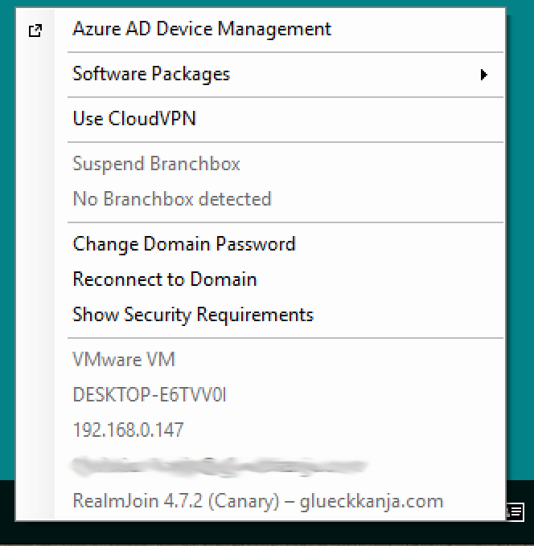

Click the software if it is shown as ready to install. This should start the Software installation. Click “Show Details”


Select and copy everything in the details If the software installation fails. Attach this information to the incident ticket.

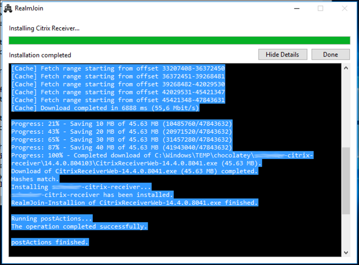

## RealmJoin Log Files

To troubleshoot package execution problems or RealmJoin Problems there are several Log Files available:

System Context Installations and other system tasks: ```C:\Windows\Logs\realmjoin.log```

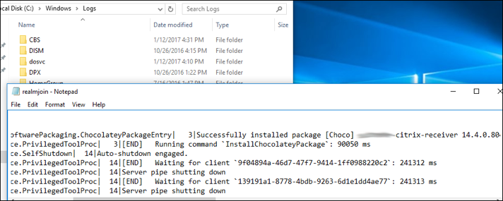

User Context Installations and other tray component tasks: ```%LocalAppData%\RealmJoin\tray.log```

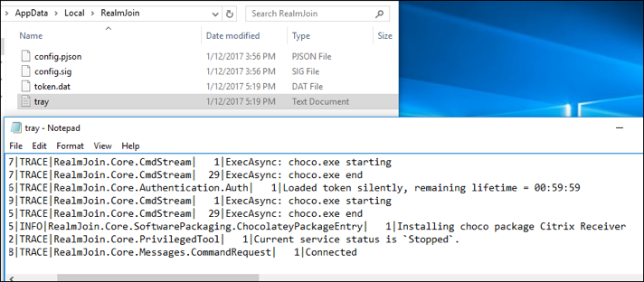

RealmJoin Service events in the application eventlog.

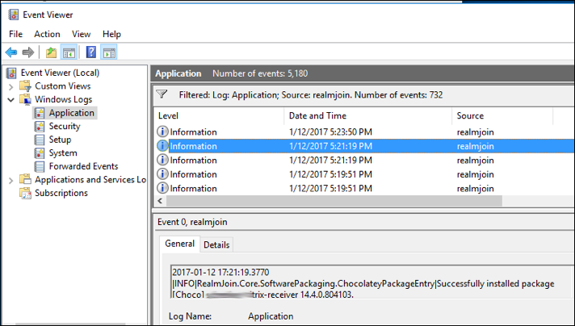

Chocolatey Install Logfiles: ```C:\ProgramData\chocolatey\logs\chocolatey.log```

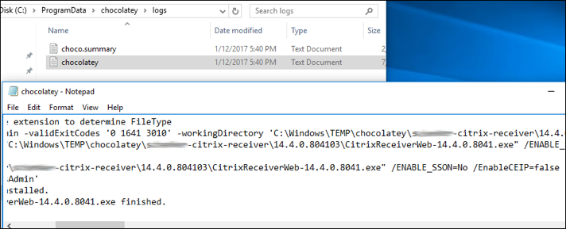

MSI Installations logs.

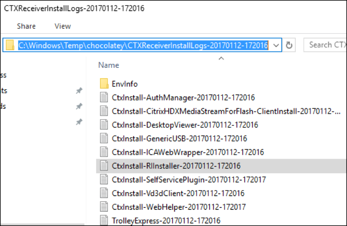

## Advanced RealmJoin Options

Hold “control” & “shift” keys and klick RealmJoin Tray icon. Select “Show Debug Window”.


You can ping the RealmJoin Backend to check connectivity.

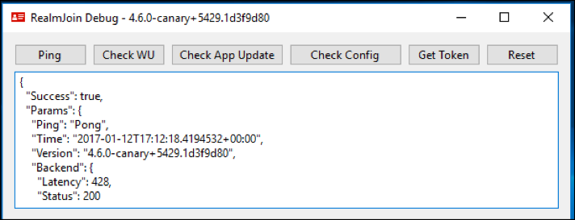

You can check if the client version is up to date.

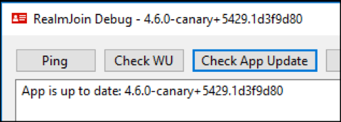

You can check if the user configuration is up to date. This includes the assigned software packages.

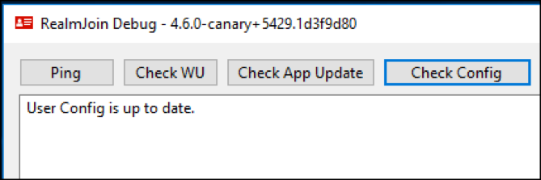

If a new user configuration is available you can update the configuration.

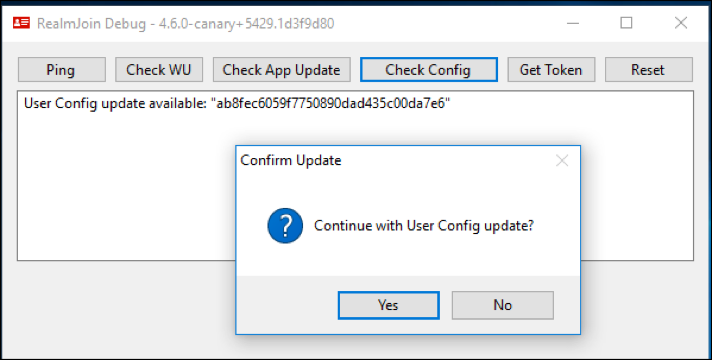

You can reset the user configuration. After this is done it is required to update the user configuration with “Check Config” 

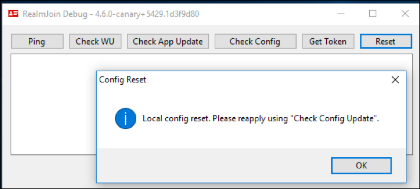

## Verify Group Membership in Office 365 Admin Center

You need to know the Software Distribution Group to which the software should be deployed.

Open Office 365 Admin Center Group management at: [Office 365 Admin Center](https://portal.office.com/adminportal/home#/groups)

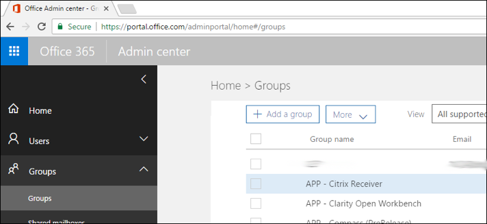

Select appropriate software distribution group and verify if the user is member of this group.

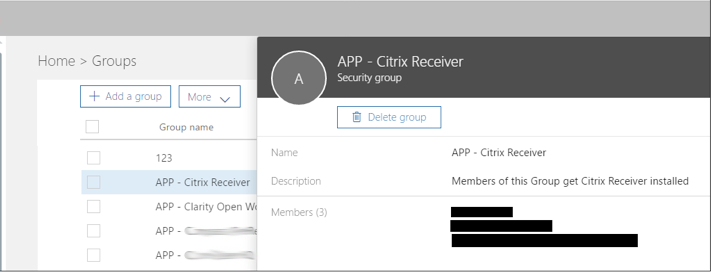

## RealmJoin Backend

Go to RealmJoin Backend admin portal at: [RealmJoin Backend Portal](https://realmjoin-backend.azurewebsites.net)

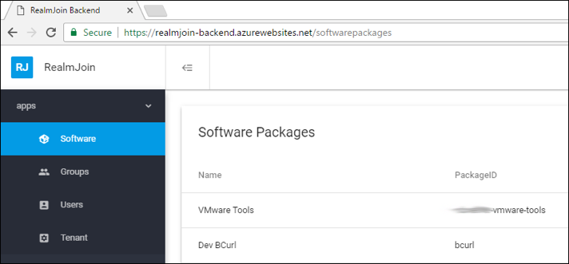

In “Software” select the required software package.
At the right you can see which users and groups have been assigned this software package.
In this example it has not been assigned to any individual user but to 2 groups. Assignments for automatic installation are shown in bold letters.

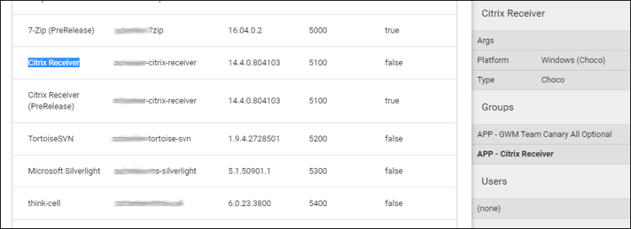

